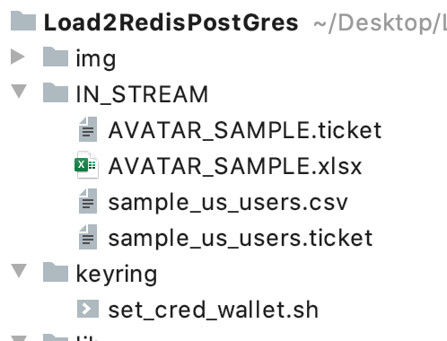

# ETL PyProject for NearRealTime(NRT) Data Stream Pipeline with REDIS backened:

*PROJECT STRUCTURE*:
- `service.py`: MAIN FastAPI async service running under uvicorn ASGI Web server 
- `run.sh` : bash script to build Docker image and start container 
- `Dockerfile`
- `/src/`
  - **./preproc.py**: class with Preprocessing functions
- `/lib/`
  - **./logger.py**: logger class and decorator
  - **./mail_sender.py**: SMTP auto emailer class
  - **./tools.py**: additional tools
- `/keyring/`
  - **./set_cred_wallet.py**: bash scrip to set and store user pass via keyring  
- `IN_STREAM`: main gate for streaming data using sshfs sync tools

### Virtual Machines
Hosted virtual machines with deployed microservises:


### REDIS DB 

* **Redis**
  * [RUN] main docker container with Redis as backend DB:
    ```dockerfile
    docker run -d -p 6379:6379 docker.io/library/redis:latest /bin/sh -c 'redis-server --requirepass *****'
    ```
* **Redisinsight**
  * [RUN] redisinsight GUI manager: 
    ```dockerfile
    docker run -d -p 8001:8001 docker.io/redislabs/redisinsight:latest
    ```
  * CHECK this endpoint to see all registered replicas and its content: ``http://65.108.56.136:8001/instance/28c3e80b-014a-4893-a3fb-3d7667a538d5/``

### Accessible Endpoints Call Order
See proper syntax for calling in Project Description Section
- [POST] ``http://65.108.56.136:8003/check_fingerprint``
- [GET] ``http://65.108.56.136:8003/register_replicas``
- [GET]  ``http://65.108.56.136:8003/stop_calling_registry`` | *OPTIONAL*
- [POST] ``http://65.108.56.136:8003/loadDf2redis``
- [GET] ``http://65.108.56.136:8003/getRegisteredReplics``
- [GET] ``http://65.108.56.136:8003/unregister_replicas``

### MAIN PROJECT DESCRIPTION
Hereafter the directory `IN_STREAM` is a joy analog of Kafka2Kafka mechanism of communications between broker and consumer topics\
We can simply perform a content synchronizations between stream directory on one remote host and look up directory on current machine using sshfs functionality:   
```shell script
RUN echo "user_allow_other" >> /etc/fuse.conf
RUN mkdir -p /app/IN_STREAM && \
    sudo sshfs -p 22 -o allow_other -o nonempty root@65.108.60.87:/mnt/DATADIR_SSH /app/IN_STREAM
```
Directory structure of ``IN_STREAM`` are shown on the following  picture:
 

Each renewable data files automatically linked with its ``.ticket`` file where all meta data are stored for future parsing by the relevant microservice.\
If future stages of current project complication sshfs directories synchronization should be replaced on the Kafka communication nodes\
If we wants to register and manipulate with our datastore one should pass a simple authentication procedure via sending POST query to remote endpoint with specified secret token
``{"md5_key":"0hJnQvG+UCtTlGJnEUzGoL/bEyUZGQdOxT3kd7TL3Tk"}``
* --> *[POST]*: `/check_fingerprint` - pass authorization from server via md5 sum comparison
```bash
root@kcloud-production-user-136-vm-179:~# curl -i -H "Content-Type: application/json" -X POST -d '{"md5_key":"0hJnQvG+UCtTlGJnEUzGoL/bEyUZGQdOxT3kd7TL3Tk"}' http://65.108.56.136:8003/check_fingerprint
HTTP/1.1 200 OK
date: Tue, 22 Feb 2022 18:17:43 GMT
server: uvicorn
content-length: 51
content-type: application/json

{"auth_status":"approved","isApprovedSession":true}
```
If one receives from the remote server approved status then the next step is to register our replicas
* --> *[GET]*: `/register_replicas`
```bash
root@kcloud-production-user-136-vm-179:~# curl -i http://65.108.56.136:8003/register_replicas
HTTP/1.1 200 OK
date: Tue, 22 Feb 2022 18:21:48 GMT
server: uvicorn
content-length: 22
content-type: application/json

{"registry":"success"}
```
If one get a responce like ``{"registry":"blocked"}`` just wait 10 sec and repeat your query. FastAPI endpoint is RateLimited by income traffic.\
On the server side, a new job is launched traversing all current `.ticket` files in the directory `IN_STREAM`

```json
{
    "file_name": "AVATAR_SAMPLE.xlsx",
    "status": "READY",
    "load_dttm": "2022-02-20:18:18:32"
}
``` 
Files with JSON **"status": "READY"** are processed and extracted all meta info are registered in REDIS Metastore.
After replicas' registration has been completed then key `STATUS` of appropriate JSON file a modified to `PROCESSED`.
Registry DB population are terminated after all tickets' status will be transformed to `REGISTERED`

To get a list of all registered replica one should send the following GET query ot the remore API service:
* --> *[GET]*: `/getRegisteredReplics`
```shell script
root@kcloud-production-user-136-vm-179:~# curl -i http://65.108.56.136:8003/getRegisteredReplics
HTTP/1.1 200 OK
date: Tue, 22 Feb 2022 19:02:54 GMT
server: uvicorn
content-length: 63
content-type: application/json

{"LIST_OF_REGISTERED_REPLICS":"sample_us_users, AVATAR_SAMPLE"}
```
* --> *[GET]*: `/stop_calling_registry`
```shell script
root@kcloud-production-user-136-vm-179:~# curl -i http://65.108.56.136:8003/stop_calling_registry
HTTP/1.1 200 OK
date: Wed, 23 Feb 2022 22:32:00 GMT
server: uvicorn
content-length: 4
content-type: application/json
```
Here one can implement a very simple trigger case there we should stop querying ``\register_replicas`` after receving successful replicas registration status.\
Below is the code from `run_registry.sh` project file:
```shell script
resp="$(curl -i -f http://localhost:8003/register_replicas 2>/dev/null 1>./registry_status | grep -oP -- '"registry":\s?\K"[a-z]+"' registry_status)"
#resp="$(!curl -i -f -s http://localhost:8003/register_replicas | \
#        python3 -c $'import io,sys\nfor line in sys.stdin: res = line\nprint(res)' | xargs)"
status="$?"

if [[ "$resp" == *"success"* ]]; then
    echo "Successfull Replica's Registration"
    curl -i -f http://localhost:8003/stop_calling_registry
    exit $status
else
    echo "Got some failure in registration"
    echo $resp
    exit 1
fi
```
We can simply add this code to the `CRONTAB` file to be running by `CRON` scheduler at specified time frequency:
```shell script
# Edit this file to introduce tasks to be run by cron.
# 
# Each task to run has to be defined through a single line
# indicating with different fields when the task will be run
# and what command to run for the task
 
# Notice that tasks will be started based on the cron's system
# daemon's notion of time and timezones.

*/1 * * * * ./root/ReddisPostGres/run_registry.sh 2>&1>./root/ReddisPostGres/__cron_out__ 
```

At the next stage when all replicas are registered from tickets look up one should initialize a process of data exctraction/preprocessing from the temporary store with the following bulk insertion into Redis database$:
* --> *[POST]*: `/loadDf2redis`
```bash
root@kcloud-production-user-136-vm-179:~# curl -i -X POST -d "?email=ektov.a.va@sberbank.ru&force_reload=1" http://65.108.56.136:8003/loadDf2redis
HTTP/1.1 200 OK
date: Tue, 22 Feb 2022 17:52:55 GMT
server: uvicorn
content-length: 90
content-type: application/json

{"file_name":"sample_us_users.csv","status":"PROCESSED","load_dttm":"2022-02-22:19:35:32"}
```
One can supply different form of POST query:
* `POST -d "?email=ektov.a.va@sberbank.ru&force_reload=1"` 
* `POST -d "?email=ektov.a.va@sberbank.ru&force_reload=0"`
* `POST -d "?email=ektov.a.va@sberbank.ru"`

Params `force_reload` is supposed to forcely update Redis DB without considering the `STATUS` value on corresponding `ticket` files

This API works in several stages on the backend side:
1. Load data from appropriate file by picking corresponding file name from ticket meta data
1. Run Preprocessing block: 
   - reduce memory usage
   - brushing json str (convert enclosing strings with double quotes and treat the case if JSON holds escaped 
   single-quotes *(\\')* or extra double quotes within text value *(\w\"\w)*)
   - analyze nandas data types
   - analyze columns with constant values (constant std)
   - calc a statistics about missing values
   - choose a strategy for filling NaN values (here we use `SimpleImputer()` class from sklearn)
   - scale data
   - find duplicated columns
   - fill `np.NaN` `pd.NaT` values with 0. | `pd.to_datetime("today")` for full-nan columns 
1. Update Redis Metastore with collected statistics from gathered data
1. Update Redis DB by *key-val* data pairs insertion into ones
1. Automatically sends an email reports with brief detalization about completed data stages. 

ALso we can run a process of all replicas unregistration:
* --> *[GET]*: `/unregister_replicas`
```bash
root@kcloud-production-user-136-vm-179:~# curl -i http://65.108.56.136:8003/unregister_replicas
HTTP/1.1 200 OK
date: Tue, 22 Feb 2022 18:21:48 GMT
server: uvicorn
content-length: 22
content-type: application/json

{"unregistry":"success"}
```
## Docker image with SSH synchronization and Keyrings support
ALl the credentials stored in user secret directories are passed to Docker at build time via unix `cat` functionality:
```shell script
#!/usr/bin/bash

KEYRINGPASS=$(cat ~/.secret/pass | sed 's/\n//g')

docker build --build-arg ssh_prv_key="$(cat ~/.ssh/id_rsa)" \
             --build-arg ssh_pub_key="$(cat ~/.ssh/id_rsa.pub)" \
             --build-arg keyring_pass="$KEYRINGPASS" \
             -f Dockerfile . -t fastapi_app #2>&1>/dev/null
``` 
After starting our service via Dockerized image one should add the following instructions to run a bash script from inside the running docker container: 
```shell script
## INITIALIZE KEYRING AND MAKE A WALLET FOR USER CREDENTIALS inside the running container
docker_id="$(docker ps -a | grep -e "gunicorn" | awk '{print $1}' | xargs)"; \
docker exec -it $docker_id /bin/sh -c "cd /app/keyring/; ./set_cred_wallet.sh $KEYRINGPASS"
```
Here we pass user `$KEYRINGPASS` needed for auto-mailing and simulate the process of storing user credentials in secure way with the full support of keyring library 
that provides an easy way to access the system keyring service from python. 
It can be used in any application that needs safe password storage
## GUNICORN support
Finally we used here a `GUNICORN` server for load balancing with 4 workers and 4 threads each with the full support of Graceful Shutdown and Graceful Reload.


Service side is propotyped on the base of: 
1. `Uvicorn` as ASGI web server implementation for Python.\
1. `FastAPI` implementation with `slowapi` `Limiter` to ratelimit API endpoint request in Fastapi application